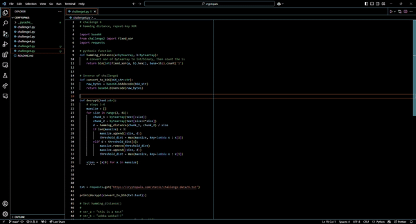

# autocom

[](https://marketplace.visualstudio.com/items?itemName=pbrowne011.autocom)
[](https://marketplace.visualstudio.com/items?itemName=pbrowne011.autocom)
[](https://marketplace.visualstudio.com/items?itemName=pbrowne011.autocom)


Autocom is a VS Code extension that automatically generates Doxygen styled
comments and natural language comments for your code using AI models such as
GPT-4 and Claude Sonnet 3.5.

<p align="center">
  
</p>

## Installation

Install autocom from
[the VS Code Marketplace](https://marketplace.visualstudio.com/items?itemName=pbrowne011.autocom)
or by searching for "autocom" in the VS Code extensions panel (`Ctrl-Shift-X`).

## Usage

To use, highlight the code you want to comment and press `Ctrl-Alt-C` /
`Cmd-Opt-C` to create a comment above using OpenAI's models. Alternatively,
press `Ctrl-Alt-G` / `Cmd-Opt-G` to create a comment using Anthropic's models.

<insert different comment gif>

A popup also appears when you highlight code, or you can right click your code
selection to comment. This is disabled by default, but can be added by setting
`autocom.enableCodeLens` to `true` in your [settings](#configuration). 

<insert highlight popup gif>

<insert right click gif>

The first time you use each model, you will be prompted for an API key, which
is [stored securely by your OS](https://vscode-api.js.org/interfaces/vscode.SecretStorage.html). 
- [Get OpenAI API key](https://platform.openai.com/account/api-keys)
- [Get Anthropic API key](https://console.anthropic.com/settings/keys)

## Features

- **Doxygen-style comments** generated for your code
- **One-click comment generation** for code blocks
- **Multiple AI models** supported:
  - Anthropic: `claude-3-sonnet` (default), `claude-3-opus`, `claude-3-haiku`
  - OpenAI: `gpt-4-turbo` (default), `gpt-4`, `gpt-3.5-turbo`
- **Smart language detection** and appropriate comment styling
- **Support for 10+ languages** including C++, Python, JavaScript, Java, Go,
  and Rust,
- **Default keyboard shortcuts** for convenient use

<insert two diff langs gifs>

## Configuration

Configure through VS Code settings (File > Preferences > Settings > Extensions > Autocom):

```jsonc
{
    // Optional: Set comment type
    "autocom.commentType": "doxygen",           // default "block", "inline

    // Optional: Enable CodeLens
    "autocom.enableCodeLens": true,              // default false

    // Optional: Choose AI models
    "autocom.openaiModel": "gpt-4-turbo",        // "gpt-4", "gpt-3.5-turbo"
    "autocom.anthropicModel": "claude-3-sonnet", // "claude-3-opus", "claude-3-haiku"
    
    // Optional: Comment style
    "autocom.commentVerbosity": "standard",     // "concise" or "detailed"
    
    // Optional: Custom prompt templates
    "autocom.customPrompts": {
        "function": {
            "standard": "Generate a comment explaining what this function does..."
        }
    }
}
```

The `customPrompts` setting allows you to override default prompts for different
comment types and verbosity levels. See documentation for template variables
and examples. (TODO: add this documentation)

## Known Issues

- Does not allow inline commments, only block comments at the top of a
  block of code
- Does not take full context of code in file or directory, only highlighted code
- Currently missing support for Doxygen (to be added as next feature)

## License

GPL 3.0

<p align="center">
  
</p>

---

### Development

```bash
# Working on features
git commit -m "add block comment tests"
git push

# Ready for new version
npm version patch  # update version in package.json (alt: minor/major)
git push --tags    # trigger the CI/CD pipeline
```

### Making GIFs

1. Screen record (TODO: make text larger - crop?)
2. Crop video (https://online-video-cutter.com/crop-video)
3. Turn into GIF (https://ezgif.com/video-to-gif)
4. Add GIF to /img, link GIF in .md file

### API Key Issues

Say you've used this extension and want to delete the API key associated with
it. If you used a model from OpenAI, it could take a while for this key to be
deactivated; thus, if you try using the extension, it will likely not ask you
for another API key (and will still work).

For reference, see [this recent forum post](https://community.openai.com/t/api-key-deleted-but-still-usable/995249/4).
Note that API keys are stored securely using
[the SecureStorage interface](https://vscode-api.js.org/interfaces/vscode.SecretStorage.html)
provided by VS Code for extensions.